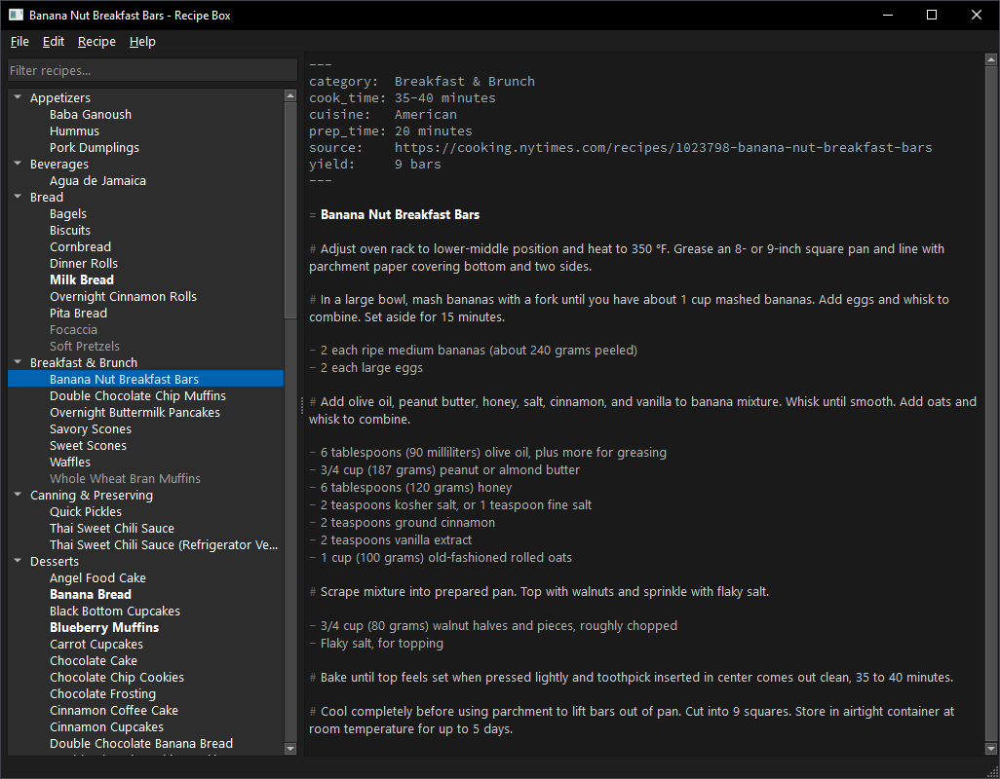

# Recipe Box

Recipe Box is a desktop recipe manager for organizing your collection using a simple markup language.



## Features

* Edit recipes in a custom markup language with syntax highlighting and validation on save.
* Import recipes from any website that supports JSON-LD metadata.
* Use an AI assistant for recipe modifications, with changes shown in a diff view.
* Export single recipes or your entire library as beautifully typeset PDFs via Typst.
* Personalize the application with customizable UI fonts, editor fonts, and color schemes.
* Cross platform. Runs on macOS, Linux, and Windows.

## Installation

[Download the latest release](https://github.com/kkestell/recipe-box/releases) from the releases page on GitHub.

## Recipe Format

The Recipe Box format is a simple, structured way to write recipes in plain text files that's easy for both humans and computers to read and write. A recipe consists of a title, optional metadata, and a series of steps, which can be grouped into named components.

```smidge
= Classic Brownies

# Melt 1 cup butter and mix with 2 cups sugar.

- 1 cup butter
- 2 cups sugar

# Beat in 4 eggs, one at a time.

- 4 eggs

# Fold in 3/4 cup cocoa powder and 1 cup flour.

- 3/4 cup cocoa powder
- 1 cup flour

# Bake 25 minutes at 350°F.
```

### Ingredients

Ingredients are prefixed with a dash (`-`) and are listed immediately following the step they belong to.

### Steps

Steps are marked with a hash symbol (`#`).

### Multiple Components

For more complex recipes, you can use a plus (`+`) prefix to create named components.

```smidge
= Chicken Parmesan

+ Chicken

# Pound 4 chicken breasts thin.

- 4 chicken breasts

# Dip in 2 eggs, then 1 cup breadcrumbs.

- 2 eggs
- 1 cup breadcrumbs

# Pan fry until golden.

+ Sauce

# Sauté 3 cloves garlic in 1 tbsp olive oil until fragrant.

- 3 cloves garlic
- 1 tbsp olive oil
  
# Add 1 can crushed tomatoes and 1 tsp oregano, then simmer.

- 1 can crushed tomatoes
- 1 tsp oregano
```

### Metadata

Recipe metadata uses YAML frontmatter format with `lower_snake_case` keys.

```
---
prep_time: 20 minutes
cook_time: 45 minutes
servings: 6
---
```

Metadata must appear at the very beginning of your recipe file.

## License

Permission to use, copy, modify, and/or distribute this software for
any purpose with or without fee is hereby granted.

THE SOFTWARE IS PROVIDED "AS IS" AND THE AUTHOR DISCLAIMS ALL
WARRANTIES WITH REGARD TO THIS SOFTWARE INCLUDING ALL IMPLIED WARRANTIES
OF MERCHANTABILITY AND FITNESS. IN NO EVENT SHALL THE AUTHOR BE LIABLE
FOR ANY SPECIAL, DIRECT, INDIRECT, OR CONSEQUENTIAL DAMAGES OR ANY
DAMAGES WHATSOEVER RESULTING FROM LOSS OF USE, DATA OR PROFITS, WHETHER IN
AN ACTION OF CONTRACT, NEGLIGENCE OR OTHER TORTIOUS ACTION, ARISING OUT
OF OR IN CONNECTION WITH THE USE OR PERFORMANCE OF THIS SOFTWARE.
